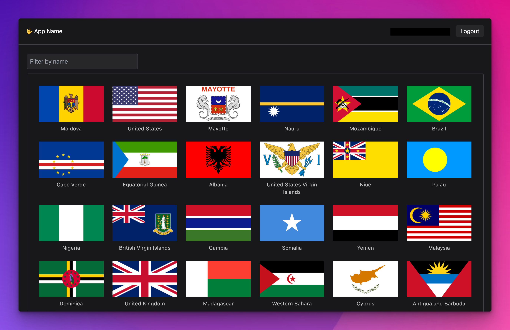

 
- Author: Víctor Falcón <victoor89@gmail.com>

## How to Execute

You need to install dependencies and run de project:
```
npm run install
npm run dev
```

## About the test

- To keep things simple, I'm not using any router or similar. Also didn't install prettier or eslint even though it would be a good idea.
- All the config related with Auth0 and the API path is inside .env file. If your local API is not under `http://localhost/api` you need to change it there.
- To log in there is a test user
  - Email: victoor89@gmail.com
  - Password: \`Giraffe#LemonTree88\` (with ` before and after)
- The project structure is super simple.
  - All components are under `src/components` by folder.
  - And everything related with API is under `src/api`.
- I did not set up any import alias, but it could be a good practice.
- I also implemented dark mode and mobile views. 
